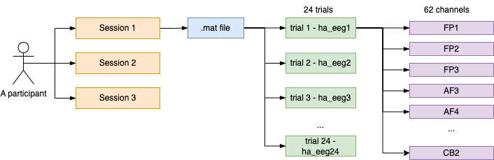
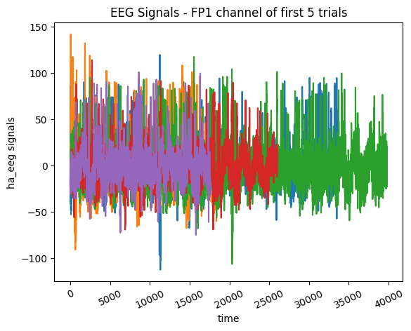

# Emotion Clasification by using raw EEG Signals
This repository contains the source code for emotion classification from `SEED-IV` dataset and `raw EEG signals.`

## Introduction: ##
The project aims to classify emotions into four main groups including `neutral`, `sad`, `fear`, and `happy` based on raw electroencephalogram (EEG) signals. 

- A note: an electroencephalogram (EEG) is a machine  that detects electrical activity in a human brain using small metal discs (electrodes) attached to the scalp. The brain cells communicate via electrical impulses and are active all the time, even when we are asleep. This activity shows up as wavy lines on an EEG recording.

## Dataset Summary ##
The provided data set (downloaded from Google Drive) contains 3 folder, in which folder 1 contain 10 .mat (Matlab) files. The overall description of the experiment is described in the image below:


### Raw EEG Signals:
- One `.mat` file represents one experiment for a person
- One individual experiment contains 24 trials correspondings to from `ha_eeg1` to `ha_eeg24 `respectively.
- For one trial, EEG signals from `62 channels` (e.g, FP1, FP2...) are collected.

### Ground truth
The labels of the three sessions for the same subjects are as follows: 
- session1_label = [1,2,3,0,2,0,0,1,0,1,2,1,1,1,2,3,2,2,3,3,0,3,0,3]; 
- session2_label = [2,1,3,0,0,2,0,2,3,3,2,3,2,0,1,1,2,1,0,3,0,1,3,1]; 
- session3_label = [1,2,2,1,3,3,3,1,1,2,1,0,2,3,3,0,2,3,0,0,2,0,1,0]; 

The labels with 0, 1, 2, and 3 denote the ground truth, neutral, sad, fear, and happy emotions, respectively.

Since only session1 is available so this will be in used to create the labels.

## Part 1: EEG Understanding ##
### Data Exploration
- Data is downsampled to 200Hz.
- The EEG signals of the same channel (e.g., FP1) for different trials are different as shown in the image below.
- The length of EEG signals depend on the duration of each video


### Feature Extraction:
In the feature extraction phase:
- Divide the eeg pre-processed input into 5 frequency sub bands using `wavelet filter banks` technique.
- In order to separate the five types of signal in the eeg recording i.e., alpha, beta, gamma, delta and theta as explained above, we use wavelet transform’s filter banks to separate the different frequencies. 
- In the lower level, there is a filter that separates the frequency band in half and gives us high pass (detail coefficient) and low pass (approximation coefficient). 
- We further take the approximation coefficient and pass it through the filter. We do this until the desired frequency ranges are not achieved. Since the filters are successively applied, they are known as filter banks.
We repeat the process for each channel. 
- In each iteration for 62 channels, we extract band power for each sub-band i.e., 
- Since there are 5 sub-bands so 5 features will be extracted for each channel. 
- The feature extraction is complete with each eeg pre processed signal having output of `62 x 5 = 310` features.

#### Bandpower Calculation
Band power for each sub-band are calculated based on following fomular.
```
def calculate_band_power(coeff_d, band_limits):
    # Calculate the power spectrum of the coefficients.
    psd = np.abs(coeff_d)**2

    # Calculate the band power by integrating the power spectrum within the band.
    band_power = np.trapz(psd, dx=(band_limits[1] - band_limits[0]))

    return band_power
```

### Feature Reduction:
In the feature reduction phase, we use Principal Component Analysis or PCA. PCA is an eigenvector-based statistical mechanism, which employs singular value decomposition, that transforms a set of correlated features into mutually uncorrelated training features, principal components or PCs. 

Steps to perform Principal Components Analysis:
1. Mean normalisation of features.
2. Calculating Covariance Matrix.
3. Calculate EigenVectors.
4. Get the reduced features or principal components.

After this process, we receive principal components PCs.

## Part 2: Multi Classes Classification: 
The problem would be famed to a multiclasses classification. Since most of data in forms of tabular data, so machine learning methods are selected to make it simple and more efficient.

The PCs from the previous step will be fed into 
multiple `sklearn classifiers` to see the results.

the SVM classifier for output into emotions.


### References
1. [Seed Dataset](http://bcmi.sjtu.edu.cn/~seed/).
2. [Wavelet transform](http://users.rowan.edu/~polikar/WTtutorial.html).
3. [Principal Components Analysis](https://www.coursera.org/learn/machine-learning).
3. [Support Vector Machines](https://www.coursera.org/learn/machine-learning).

