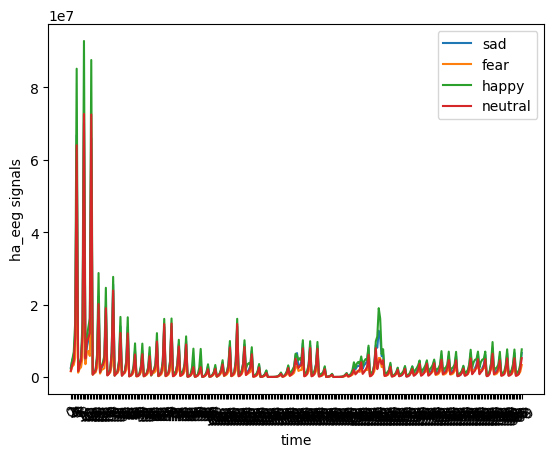
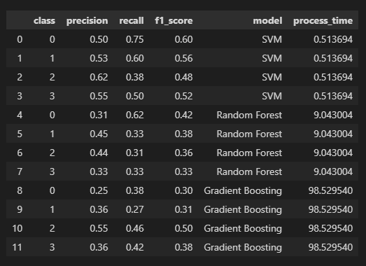

# Emotion Clasification by using raw EEG Signals
This repository contains the source code for emotion classification from `SEED-IV` dataset and `raw EEG signals.`

## Introduction: ##
The project aims to classify emotions into four main groups including `neutral`, `sad`, `fear`, and `happy` based on raw electroencephalogram (EEG) signals. 

## Dataset Summary ##
The data set provided (downloaded from Google Drive) consists of 3 folders, of which only folder 1 contains 10 .mat (MATLAB) files. The overall description of the experiment is shown in the image below.


### Raw EEG Signals:
- One `.mat` file represents one experiment for a person
- One individual experiment contains 24 trials correspondings to from `ha_eeg1` to `ha_eeg24 `respectively.
- For one trial, EEG signals from `62 channels` (e.g, FP1, FP2...) are collected.

### Ground truth
The labels of the three sessions for the same subjects are as follows: 
- session1_label = [1,2,3,0,2,0,0,1,0,1,2,1,1,1,2,3,2,2,3,3,0,3,0,3]; 
- session2_label = [2,1,3,0,0,2,0,2,3,3,2,3,2,0,1,1,2,1,0,3,0,1,3,1]; 
- session3_label = [1,2,2,1,3,3,3,1,1,2,1,0,2,3,3,0,2,3,0,0,2,0,1,0]; 

The labels with 0, 1, 2, and 3 denote the ground truth, neutral, sad, fear, and happy emotions, respectively.

Since only session1 is available so this will be in used to create the labels.

## Part 1: EEG Understanding ##
### Data Exploration
- Data is downsampled to 200Hz.
- The EEG signals of the same channel (e.g., FP1) for different trials are different as shown in the image below.
- The length of EEG signals depend on the duration of each video


### Preprocessing and Feature Extraction:

- First, the eeg signals is divided into 5 frequency sub bands by using `Discrete Wavelet Transform (DWT)`.
- The `DWT` uses a specific type of wavelet filter bank, called a `quadrature mirror filter bank (QMF)`. The QMF consists of two filters: a low-pass filter and a high-pass filter. The low-pass filter is used to extract the low-frequency components of the signal, while the high-pass filter is used to extract the high-frequency components of the signal. The output of the QMF is a set of coefficients, which represent the different frequency components of the signal.
- Two parameters are defined at the begining:
```
WAVELET = "db6"  # method to transform eeg signals
MAX_LEVEL = 5  # number of sub-bands that will be divided including delta, theta, alpha, beta and gamma.
```
- Then perform discrete wavelet transform (DWT) on an EEG signal by following code. 
```
for band in range(MAX_LEVEL):
        (data, coeff_d) = pywt.dwt(data, WAVELET)
        dwt_bands.append(coeff_d)
```
This will return the coefficients of the DWT, the coefficients then use to calculate the band power for each band.

**Bandpower Calculation**

The band power for each sub-band is calculated using the following formula:

```
def calculate_band_power(coeff_d, band_limits):
    # Calculate the power spectrum of the coefficients.
    psd = np.abs(coeff_d)**2

    # Calculate the band power by integrating the power spectrum within the band.
    band_power = np.trapz(psd, dx=(band_limits[1] - band_limits[0]))

    return band_power
```
Those steps are repeated for all 62 channels. 

**Calculate the number of features and data points**

- There are 10 participants, each of which has 24 trials.
- Each trial has 62 channels.

Therefore:

- For each participant and trial, the EEG signals will be collected as a matrix of size (62, n), where `n` is the duration of the video.
- There will be a total of 24 x (62, n) matrices for each participant.
- The data will be converted into band powers of 5 sub-bands, so the number of features for each trial will be 62 x 5 = 310.
The total number of data points will be (10 x 24, 62 x 5) = (240, 310).

### Reducing Dimensionality:
310 features seem to be large for machine learning model, so Principal Component Analysis (PCA) from scikit-learn will be applied to reduce the number of features. 

- `n_components` is set to 100 as the number of features to keep.



The image shows that happy emotions are associated with higher band power in the high-frequency bands (beta and gamma), while sad emotions are associated with lower band power in the low-frequency bands (delta and theta). It seems to make sense.

## Part 2: Multi Classes Classification: 

The problem can be formulated as a multi-class classification problem. Since the data is in tabular form, machine learning methods are selected to make the problem simpler and more efficient.

The principal components (PCs) from the previous step will be fed into multiple `scikit-learn classifiers` to evaluate the results.

The three classifiers selected for the experiment are `Support Vector Machines (SVM)`, `Random Forest Classifiers`, and `Gradient Boosting Classifiers`.

**Grid Search and Machine learning models**

- The experiment used a combination of grid search and machine learning models, rather than feeding data directly to the models.
- This may have increased the computational cost, but it allowed us to find a better combination of hyperparameters in the grid.

**Experiment Result**

The experiment results are extracted from `sklearn classification report` along with the processing time (seconds) in the table below.



### Findings
#### Experiment Results

- The SVM model has the highest F1 score for class 0 (0.60), followed by the Random Forest model (0.42) and the Gradient Boosting model (0.50).
- The SVM model has the highest precision for class 2 (0.62), followed by the Random Forest model (0.44) and the Gradient Boosting model (0.55).
- The SVM model has the highest recall for class 1 (0.75), followed by the Random Forest model (0.62) and the Gradient Boosting model (0.46).
- The Gradient Boosting model has the slowest training time, followed by the SVM model and the Random Forest model.

Overall, the SVM model seems to be the best performing model, followed by the Gradient Boosting model and the Random Forest model. Dataset is balanced so models are not biased towards any particular class. However, the F1 score is not really high. 

#### Improvement Points

Based on the experimental results, here are some points that could help improve the model:

- Even after reducing the number of features to 100 principal components (PCs), the number of features is still high for machine learning models, as the dataset is not large. Collecting more data would help improve this.
- Only band power is currently calculated to convert into features to feed into machine learning models. We can improve the model by finding more relevant features, such as band power.
- I have already tried using grid search to find the best parameters for machine learning models, but I did not have enough time to experiment with many parameters. Fine-tuning these hyperparameters would help improve the model.
- Finally, trying some basic deep learning models would also be helpful.


### References
1. [Seed Dataset](https://bcmi.sjtu.edu.cn/home/seed/).
2. [Wavelet transform](https://pywavelets.readthedocs.io/en/latest/ref/dwt-discrete-wavelet-transform.html).
3. [scikit-learn](https://scikit-learn.org/stable/).


